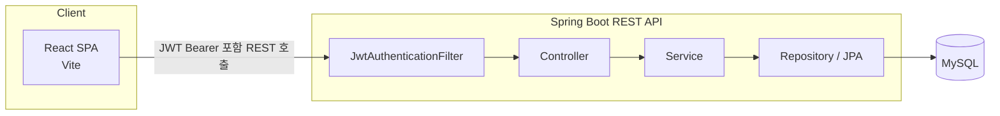
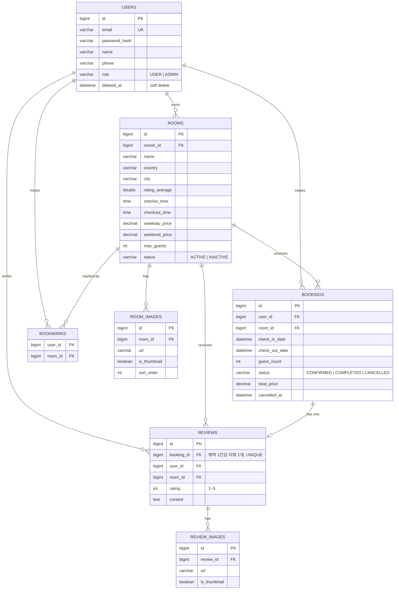

# 👻 NUBI MYOBI 🪦

 > 모든 묘소를 누비자


## 목차

1. [프로젝트 소개](#프로젝트-소개)
2. [실행 방법](#실행-방법-로컬)
3. [화면 구성](#화면-구성)
4. [기술 스택](#기술-스택)
5. [아키텍처](#아키텍처)
6. [DB 테이블 구조](#db-테이블-구조)
7. [API 문서 (Swagger)](#api-문서-swagger)
8. [Future Work](#future-work)
9. [Members](#members)

## 프로젝트 소개

**NUBI MYOBI**는 세계 각지의 유명 묘소를 하룻밤 빌려 묵을 수 있는 숙박 예약 플랫폼입니다.

주요 기능:
- 키워드, 입실일/퇴실일, 인원수 조건으로 숙소 검색
- 평일/주말 요금이 분리된 예약 및 예상 금액 계산
- 북마크, 리뷰 작성 및 평점
- JWT 기반 로그인/회원가입
- 호스트용 어드민 대시보드: 숙소/사진/예약 관리
- 체크아웃 시각이 지난 예약을 매시 정각에 자동으로 완료하는 스케줄러

## 실행 방법 (로컬)

requirements: JDK 21, Node.js 20+, MySQL 8.0+

### 1. Database

MySQL에 접속해서 빈 데이터베이스를 생성해주세요.
테이블은 백엔드가 뜰 때 JPA 엔티티 기준으로 자동 생성됩니다.

```sql
CREATE DATABASE accommodation_db CHARACTER SET utf8mb4 COLLATE utf8mb4_unicode_ci;
```

### 2. env 파일 세팅 & Backend 실행

`backend\.env` 파일을 생성하고 아래 값들을 채워주세요.

```
# Database
DB_URL=
DB_USERNAME=
DB_PASSWORD=

# JWT
JWT_SECRET=

# Mail
MAIL_HOST=
MAIL_PORT=
MAIL_USERNAME=
MAIL_PASSWORD=

# File Upload Path
FILE_UPLOAD_DIR=
```

이후 IDE에서 백엔드 서버를 실행해주세요.
IntelliJ 사용시 PR #48에서 env 설정 관련을 확인하세요.

### 3. Dummy Data

스크립트를 실행하여 DB에 더미 데이터를 채워주세요.

```powershell
cd backend
powershell -ExecutionPolicy Bypass -File .\seed-dummy-data.ps1
```

### 4. 프론트엔드 실행

```bash
cd frontend
npm run dev
```

## 화면 구성

### 사용자 영역 (`/`)

| 경로 | 화면 | 접근 |
|---|---|---|
| `/` | 홈 (검색 + 추천 숙소) | 공개 |
| `/rooms` | 숙소 목록/검색 | 공개 |
| `/rooms/:roomId` | 숙소 상세 + 예약 위젯 | 공개 |
| `/login` | 로그인 | 비로그인 전용 |
| `/signup` | 회원가입 | 비로그인 전용 |
| `/find-account` | 아이디/비밀번호 찾기 | 비로그인 전용 |
| `/booking/:roomId` | 예약 확인/확정 | 로그인 필요 |
| `/booking/result` | 예약 완료 결과 | 로그인 필요 |
| `/mypage` | 마이페이지 홈 | 로그인 필요 |
| `/mypage/edit` | 회원정보 수정/탈퇴 | 로그인 필요 |
| `/mypage/bookings` | 예약 내역 목록 | 로그인 필요 |
| `/mypage/bookings/:bookingId` | 예약 상세 · 취소 · 리뷰 작성 | 로그인 필요 |
| `/mypage/bookmarks` | 북마크 목록 | 로그인 필요 |
| `/whoami` | 계정 권한 진단 화면 | 로그인 필요 |

### 관리자(호스트) 영역 (`/admin`)

| 경로 | 화면 | 접근 |
|---|---|---|
| `/admin` | 대시보드 (보유 숙소·매출·예약 요약) | ADMIN 전용 |
| `/admin/rooms` | 숙소 관리 목록/검색 | ADMIN 전용 |
| `/admin/rooms/new` | 숙소 등록 | ADMIN 전용 |
| `/admin/rooms/:roomId` | 숙소 상세 | ADMIN 전용 |
| `/admin/rooms/:roomId/edit` | 숙소 수정 | ADMIN 전용 |
| `/admin/rooms/:roomId/images` | 숙소 사진 관리 (드래그 정렬·대표 사진 지정) | ADMIN 전용 |
| `/admin/bookings` | 예약 관리 목록/검색 | ADMIN 전용 |
| `/admin/bookings/:bookingId` | 예약 상세/취소 | ADMIN 전용 |

사용자 영역과 관리자 영역은 `UserLayout`(상단 헤더+푸터) / `AdminLayout`(좌측 사이드바)으로 레이아웃 자체가 분리되어 있고, 로그인한 USER 계정은 네비게이션의 "호스팅하기" 버튼으로 즉시 ADMIN 권한을 신청해 관리자 영역으로 넘어갈 수 있습니다.

## 기술 스택

**Backend**
- Java 21, Spring Boot 4.1.1 (Gradle)
- Spring Web MVC, Spring Data JPA (Hibernate) + MySQL 8
- JWT 인증
  - `io.jsonwebtoken` 로 토큰 발급/검증
  - 커스텀 `OncePerRequestFilter`로 처리
  - Spring Security 중 `spring-security-crypto`의 BCrypt만 사용
- `springdoc-openapi` 로 Swagger UI 자동 생성
- `spring-dotenv` 로 `.env` 파일의 값을 애플리케이션 설정에 주입
- `@Scheduled` 기반 배치 (예약 자동 완료 처리)

**Frontend**
- React 19 + Vite 8, JavaScript
- react-router-dom v7: 사용자/관리자 영역을 라우트 트리로 분리
- React Context API로 전역 상태 관리

## 아키텍처

React SPA(프론트엔드)와 Spring Boot REST API(백엔드)가 완전히 분리된 구조입니다.



## DB 테이블 구조

별도 마이그레이션 도구 없이 JPA 엔티티 기준으로 생성되는 테이블입니다. (`users`, `rooms`, `room_images`, `bookings`, `bookmarks`, `reviews`, `review_images`)




## API 문서 (Swagger)

백엔드 실행 후 아래 주소에서 전체 API 명세를 확인할 수 있습니다.

- Swagger UI: http://localhost:8080/swagger-ui.html
- OpenAPI JSON: http://localhost:8080/v3/api-docs


## Future Work

- **결제 연동**: 예약은 결제 없이 즉시 확정됩니다. PG 연동 및 결제 상태 관리가 없습니다.
- **이미지 스토리지 이전**: 숙소/리뷰 사진이 로컬 디스크에 저장됩니다. 배포 환경에서는 S3 등 외부 오브젝트 스토리지로 교체가 필요합니다.
- **테스트 코드 및 CI 파이프라인**: 자동화된 테스트와 빌드/배포 파이프라인이 아직 없습니다.
- **소셜 로그인**: 이메일/비밀번호 로그인만 지원합니다.

## Members
 
<table>
    <tr height="160px">
        <td align="center" width="150px">
            <a href="https://github.com/mun-yu"></a>
            <br />
            <a href="https://github.com/mun-yu"><strong>문유식</strong></a>
            <br />
        </td>
        <td align="center" width="150px">
              <a href="https://github.com/wonnowone"></a>
              <br />
              <a href="https://github.com/wonnowone"><strong>이재원</strong></a>
              <br />
        </td>
        <td align="center" width="150px">
              <a href="https://github.com/dusenswf"></a>
              <br />
              <a href="https://github.com/dusenswf"><strong>장연주</strong></a>
              <br />
        </td>
        <td align="center" width="150px">
              <a href="https://github.com/jiy0-0nv"></a>
              <br />
              <a href="https://github.com/jiy0-0nv"><strong>정지윤</strong></a>
              <br />
        </td>
        <td align="center" width="150px">
              <a href="https://github.com/jingooo5
"></a>
              <br />
              <a href="https://github.com/jingooo5
"><strong>*special* 김진욱</strong></a>
              <br />
        </td>
    </tr>
</table>  

<br><br>
